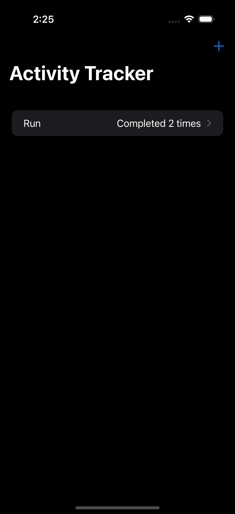

# HabitTrack

A simple and intuitive mobile application built with **Swift** for **iOS** to help you track your daily habits and build positive routines.

## Overview

HabitTrack allows you to:

* **Create and manage habits:** Easily add new habits you want to track.
* **Mark progress:** Check off habits as you complete them each day.
* **Visualize your streaks:** See how many consecutive days you've successfully completed a habit, saved right to your phone.

## Demo

  

A short screen recording demonstrating the core functionality of the HabitTrack app is available at [https://www.youtube.com/shorts/pwnyvZCTbRI](https://www.youtube.com/shorts/pwnyvZCTbRI). The video demos:

* Creating a new habit.
* Marking a habit as complete.
* Viewing the habit streak.
* Deleting a habit.
* Navigating through the app.

## Getting Started

To run HabitTrack on your iOS device or simulator:

1.  Make sure you have **Xcode** installed on your macOS system.
2.  Clone the repository: `git clone https://github.com/Melissaeb/HabitTrack.git`
3.  Navigate to the project directory: `cd HabitTrack`
4.  Open the `HabitTrack.xcodeproj` or `HabitTrack.xcworkspace` file in Xcode.
5.  Build and run the app on a simulator or your connected iOS device.
